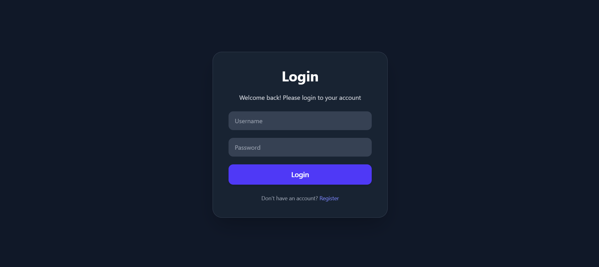
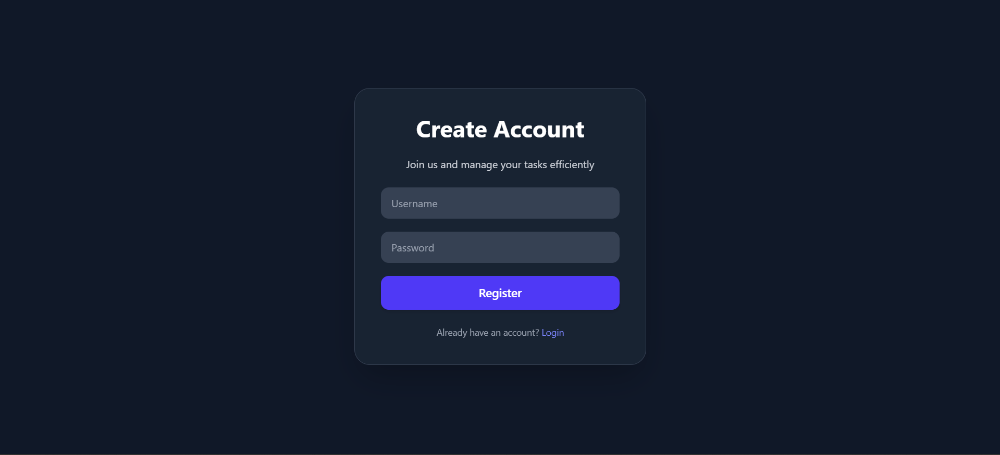
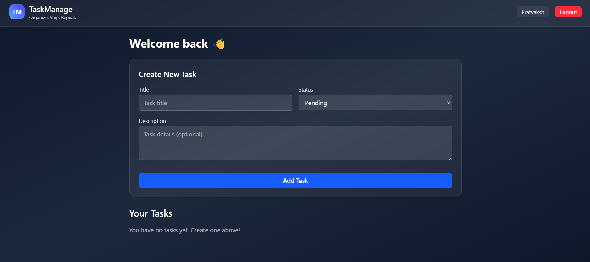

# 📌 Task Manager Web App

A full-stack MERN (MongoDB, Express, React, Node.js) application with JWT authentication, task CRUD operations, protected routes, Zod validation, and a clean dark UI.

## 🚀 Features

- **User Registration & Login** (JWT-based authentication)
- **Fully protected backend routes** with middleware
- **Create / Update / Delete / List Tasks**
- **Status Toggle** (Pending → Completed)
- **Client-side form validation** (Zod + React Hook Form)
- **Axios Interceptors** (Auto-attach JWT token)
- **Dark UI** with TailwindCSS
- **MongoDB** with Mongoose ODM
- **Error handling middleware**
- **Central AuthContext** for state management
- **Responsive Dashboard** design

## 📸 Screenshots

### Login Page

*Clean and minimal login interface with form validation*

### Registration Page

*User registration with password confirmation*

### Create Task Modal

*Modal form for creating new tasks*

### Dashboard - Task List

*Main dashboard showing all tasks with status indicators*


## 📁 Project Structure

```
/project-root
│
├── backend/
│   ├── server.js
│   ├── routes/
│   ├── controllers/
│   ├── middleware/
│   ├── models/
│   └── utils/
│
├── frontend/
│   ├── src/
│   │   ├── api/
│   │   ├── components/
│   │   ├── context/
│   │   ├── hooks/
│   │   ├── pages/
│   │   └── utils/
│   └── index.html
│
└── README.md
```

## 🛠️ Tech Stack

### Frontend
- React + Vite
- React Router DOM
- Tailwind CSS
- Axios
- React Hook Form + Zod

### Backend
- Node.js
- Express
- MongoDB + Mongoose
- JWT Authentication
- CORS
- Zod request validation

## ⚙️ Local Setup

### 1️⃣ Clone the Repository

```bash
git clone https://github.com/PRATYAKSH15/Assignment_task_management.git
cd task-manager
```

### 🧩 Backend Setup (Node + Express)

Navigate to backend folder:

```bash
cd backend
```

Install dependencies:

```bash
npm install
```

#### 🔐 Create `.env` file

Create a `.env` file in the `backend` directory:

```env
MONGO_URI=mongodb://localhost:27017/taskmanager
JWT_SECRET=your_super_secret_key
PORT=5000
```

#### ▶️ Start Server

```bash
npm run dev
```

Backend will run at: **http://localhost:5000**

### 🎨 Frontend Setup (React + Vite)

Navigate to frontend:

```bash
cd ../frontend
```

Install dependencies:

```bash
npm install
```

#### ▶️ Start Frontend

```bash
npm run dev
```

Frontend runs at: **http://localhost:5173**

## 🧪 Running Tests

### Backend Tests (Jest + Supertest)

```bash
cd backend
npm test
```

## 📡 API Documentation

### 🔐 Auth Routes

#### ➤ POST `/api/auth/register`
Create a new user.

**Request Body:**
```json
{
  "username": "john123",
  "password": "mypassword"
}
```

**Response:**
```json
{
  "token": "JWT_TOKEN",
  "user": {
    "_id": "123",
    "username": "john123"
  }
}
```

#### ➤ POST `/api/auth/login`
Login and get JWT token.

**Request Body:**
```json
{
  "username": "john123",
  "password": "mypassword"
}
```

**Response:**
```json
{
  "token": "JWT_TOKEN",
  "user": {
    "_id": "123",
    "username": "john123"
  }
}
```

### 📝 Task Routes (Protected)

> **Note:** All task routes require the following header:
> ```
> Authorization: Bearer <jwt_token>
> ```

#### ➤ GET `/api/tasks`
Get all tasks of the logged-in user.

**Response:**
```json
[
  {
    "_id": "a1",
    "title": "Buy groceries",
    "description": "Get milk, eggs, and bread",
    "status": "pending",
    "createdAt": "2024-01-15T10:30:00Z",
    "updatedAt": "2024-01-15T10:30:00Z"
  }
]
```

#### ➤ POST `/api/tasks`
Create a new task.

**Request Body:**
```json
{
  "title": "New Task",
  "description": "Details about the task",
  "status": "pending"
}
```

#### ➤ PUT `/api/tasks/:id`
Update a specific task.

**Request Body Example:**
```json
{
  "status": "completed"
}
```

#### ➤ DELETE `/api/tasks/:id`
Delete a task.

**Response:**
```json
{
  "message": "Task removed"
}
```

## 🧰 Useful Commands

Install all packages:
```bash
npm install
```

Clean install:
```bash
rm -rf node_modules package-lock.json
npm install
```

Build frontend for production:
```bash
cd frontend
npm run build
```

Start production server:
```bash
cd backend
npm start
```

## 🔒 Environment Variables

### Backend (`/backend/.env`)
```env
MONGO_URI=mongodb://localhost:27017/taskmanager
JWT_SECRET=your_super_secret_key
PORT=5000
```

## 🤝 Contributing

Contributions, issues, and feature requests are welcome! Feel free to check the [issues page](https://github.com/PRATYAKSH15/Assignment_task_management.git/issues).

## 👤 Author

**Your Name**
- GitHub: [Pratyaksh](https://github.com/PRATYAKSH15)


## ⭐ Show your support

Give a ⭐️ if this project helped you!